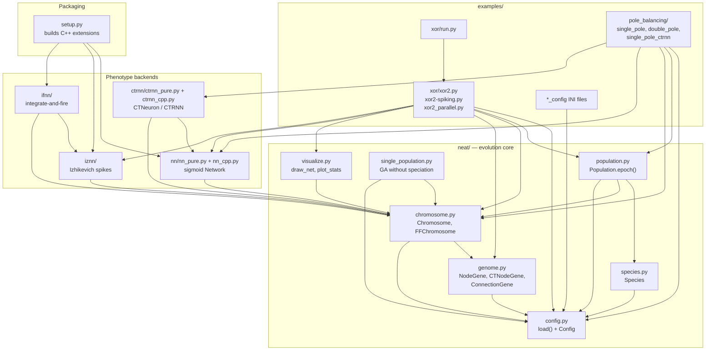
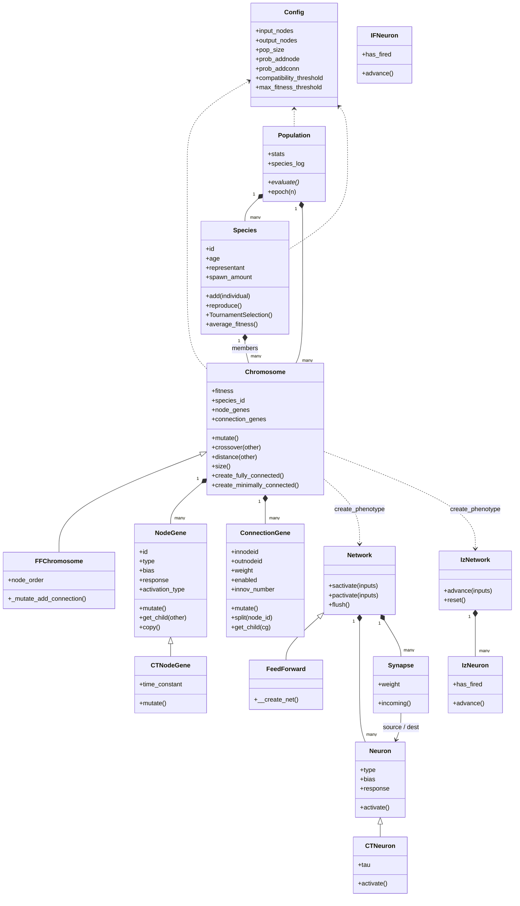
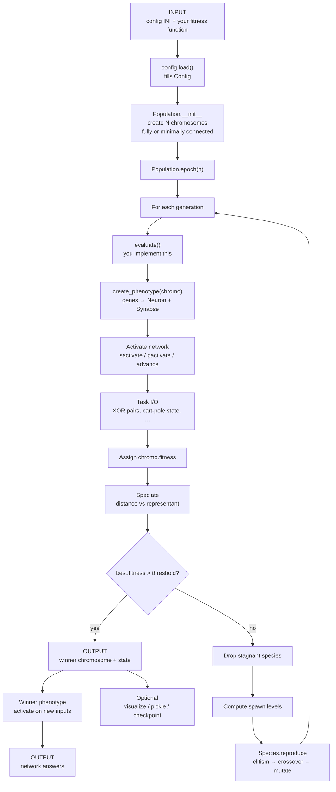
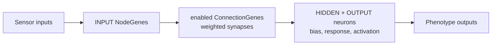

# NEAT-Python: How It Works

NEAT-Python is a 2007 academic implementation of
**NeuroEvolution of Augmenting Topologies**.
It evolves both network structure (nodes and connections)
and parameters (weights, biases).
It is Python 2.7 only.

This document describes how the repository is organized,
how the classes relate, and how data moves from input to output.

---

## How it works

You do not train a fixed network with backpropagation.
You evolve a **population of chromosomes**.
Each chromosome is a genotype (node genes + connection genes with
innovation numbers).
That genotype is decoded into a phenotype (a runnable network).
You score each network with a fitness function you write.
The genetic algorithm then speciates, crosses over, and mutates
until fitness is high enough.

Four phenotype backends exist:

| Backend     | Model                                 | Typical use                         |
|-------------|---------------------------------------|-------------------------------------|
| `neat.nn`   | Discrete sigmoid / tanh               | Classification (XOR), control       |
| `neat.ctrnn`| Continuous-time RNN (Euler / RK4)     | Dynamical control, artificial life  |
| `neat.iznn` | Izhikevich spiking                    | Spike-based tasks                   |
| `neat.ifnn` | Integrate-and-fire                    | Simpler spiking                     |

Each has a pure-Python path and an optional C++ extension for speed.

---

## How you use it

The XOR example is the intended starting point:

1. Write an INI config (`xor2_config`) for phenotype, GA, compatibility, and species.
2. Load it with `config.load(...)`.
3. Set `chromosome.node_gene_type` (`NodeGene` or `CTNodeGene`).
4. Write `eval_fitness(population)`: for each chromosome, `create_phenotype` / `create_ffphenotype`, activate the net, assign `chromo.fitness`.
5. Hook it: `population.Population.evaluate = eval_fitness`.
6. Run `pop = Population(); pop.epoch(n)`.
7. Read the winner from `pop.stats`, visualize, or pickle it.

Shipped experiments:

- **XOR** — feedforward, parallel (Parallel Python), and spiking variants
- **Single-pole / double-pole balancing** — recurrent / CTRNN control
- **`run.py`** — repeat an experiment and average generations, nodes, connections, evaluations
- **`single_population.py`** — a simpler GA without speciation (rank / roulette / tournament)

You can also resume from gzipped checkpoints, save the best chromosome
each generation, and plot fitness, speciation, and network topology
(`visualize.py`).

---

## 1. Script-level diagram — Component (module) diagram

In UML this is a **component diagram**
(also called a **module** or **package diagram**).
Boxes are files/packages; arrows are imports / “uses”.

---

## 2. Class-level diagram — Class diagram

In UML this is a **class diagram**:
types, inheritance, and “has-a” relationships.

`Population.evaluate` is a hook you override.
`single_population.Population` is a separate class with the same name:
no species, plus `SelecaoTorneio` / `SelecaoRoleta` / `SelecaoRank`.

---

## 3. Main input → output flow — Activity diagram

This is an **activity diagram** (UML process flow).
If you only track data moving through stages,
the same picture is a **data-flow diagram (DFD)**.
If you emphasize object calls over time, it would be a **sequence diagram**.
Here the process is the important part.

Inside one evaluation (the actual input → output of a network):

- Feedforward XOR uses `sactivate` (neurons in topological order).
- Control / recurrent / CTRNN uses `pactivate` (all neurons update together).
- Spiking nets use `advance` until a spike, timeout, or ambiguous answer.

---

## Diagram names

| What you asked for        | Standard name                                              | What it shows                                      |
|---------------------------|------------------------------------------------------------|----------------------------------------------------|
| Script level              | **Component diagram** (UML), also **module / package diagram** | Files and packages and how they depend on each other |
| Class level               | **Class diagram** (UML)                                    | Types, inheritance, composition                    |
| Input → output process    | **Activity diagram** (UML); same idea as a **data-flow diagram** | Steps from config + fitness to a winner network and its answers |

A **sequence diagram** would be the fourth common UML view:
objects calling each other over time
(`Population.epoch` → `evaluate` → `create_phenotype` → `sactivate` →
`Species.reproduce` → `crossover` / `mutate`).
The activity diagram above is the better match for
“process between input and output.”
